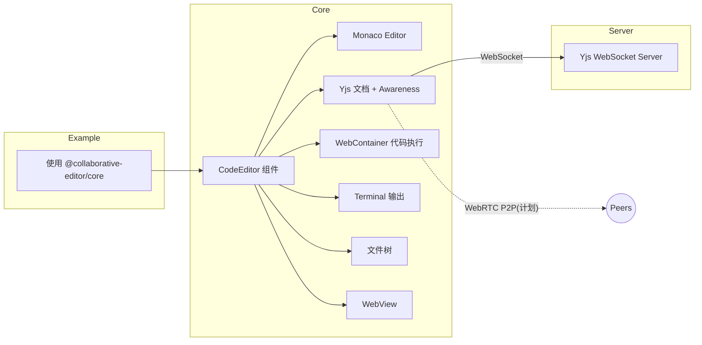

# 协同代码编辑器

基于 Vite + React 19 + Yjs + Monaco Editor + WebContainer 的实时协同代码编辑器组件。

## 📦 项目结构（Monorepo）

```
collaborative-editor/
├── packages/
│   ├── core/                # 组件包（需发布）
│   │   └── src/
│   └── server/              # WebSocket 服务器包（需发布）
│       └── src/
├── example/                 # 示例应用（需部署）
│   └── src/
└── pnpm-workspace.yaml
```

## 🧭 架构图



## 🔌 插件化设计（目标）

- 以插件/配置的方式组合功能，按需启用。
- 默认提供基于 WebSocket 的协同编辑、代码执行与终端展示。
- 通过配置解锁/组合文件树、WebView、WebRTC 传输等能力。

### 拟定配置接口示例

```tsx
<CodeEditor
  roomId="room-1"
  user={{ id: "u-1", name: "Alice" }}
  wsUrl="ws://localhost:1234"
  features={{
    terminal: true,
    fileTree: true,
    webview: false
  }}
  transport={{
    type: "websocket",
    url: "ws://localhost:1234"
  }}
/>
```

### 功能模块（规划）

- 协同：`Yjs` 文档与光标同步，传输可选 `WebSocket`、`WebRTC`（计划）。
- 编辑器：`Monaco Editor`，支持多文件与语法高亮。
- 运行时：`WebContainer` 进行代码执行与输出捕获。
- 终端：展示执行输出与交互输入（可开关）。
- 文件树：基础 CRUD 与活动文件切换（可开关）。
- WebView：在同页展示预览或外部页面（可开关）。
- WebComponent：仍和框架都可使用。

## ✨ 特性

- 🎨 Monaco Editor 编辑器 + 语法高亮
- 🤝 Yjs 实时协同编辑 (开发中)
- 📁 文件树管理 (增删改查)
- ▶️ 代码执行 + 终端输出 (WebContainer)
- 🎯 简洁设计,专注核心功能

## 🚀 快速开始

### 安装依赖

```bash
pnpm install
```

### 开发模式

```bash
pnpm dev
```

访问 http://localhost:3000

### 生产构建

```bash
pnpm build
pnpm start
```

## 📦 使用方式

### 本地开发

```bash
# 克隆项目
git clone your-repo
cd collaborative-editor

# 安装依赖
pnpm install

# 启动开发（自动启动应用 + WebSocket 服务器）
pnpm dev:all
```

### 作为 npm 包使用

```bash
pnpm add @collaborative-editor/core
pnpm add -D @collaborative-editor/server
```

```tsx
import { CodeEditor } from '@collaborative-editor/core'

export default function Page() {
  return (
    <CodeEditor
      roomId="my-room"
      user={{ id: 'user-123', name: '张三' }}
      wsUrl={process.env.NEXT_PUBLIC_WS_URL}
      initialFiles={{ 'main.js': 'console.log("Hello")' }}
    />
  )
}
```

## 🛠️ 技术栈

- **框架**: Next.js 15 + React 19
- **编辑器**: Monaco Editor 0.50.x
- **协同**: Yjs 13.6.x
- **运行时**: WebContainer API 1.3.x
- **状态管理**: Zustand 4.5.x
- **样式**: TailwindCSS 3.4.x

## 📝 开发进度

- [X] 项目初始化
- [X] Monaco 编辑器集成
- [X] 文件树组件
- [X] 终端输出组件
- [X] WebContainer 代码执行
- [X] 用户ID稳定性管理
- [X] Yjs 协同编辑完善
- [X] 远程光标显示
- [ ] WebSocket 服务器优化
- [ ] 断线重连机制

## 📦 npm 包说明

### @collaborative-editor/core

前端 React 组件，包含编辑器、协同、终端等功能。

### @collaborative-editor/server

WebSocket 服务器，提供协同编辑的实时通信。

```bash
# 全局安装
npm install -g @collaborative-editor/server
collab-server start

# 或直接使用
npx @collaborative-editor/server start
```

## 📖 文档

查看 [CHANGELOG.md](./docs/CHANGELOG.md) 了解更新日志

## ⚠️ 注意事项

- WebContainer 需要支持 SharedArrayBuffer 的现代浏览器
- 已配置 COOP/COEP 响应头
- 简化版暂不实现预览窗口和开发服务器

## 📄 许可证

MIT
